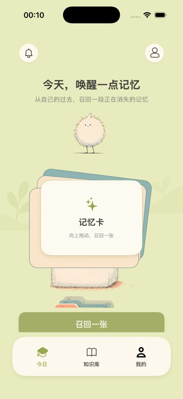

<div align="center">
  
  <h1>Omo · 哦莫</h1>
  <p>把保存过的碎片，变成会再次想起的记忆。</p>
  <p><a href="https://github.com/starvingarc/Omo">github.com/starvingarc/Omo</a></p>
</div>

<p align="center">
  
</p>

## Omo 是什么

Omo 面向在 B站、抖音、小红书等平台保存的高价值碎片。它恢复原始证据，从每份内容中提炼一张记忆卡，并在合适的时间把它重新带回用户面前。

```text
截图 / 视频 → 恢复证据 → 一张记忆卡 → 主动回忆 → 刮开答案 → 间隔复习
```

- **有证据**：答案、解释和题目均绑定原始内容；证据不足时仅存档或要求确认。
- **一份内容，一张主卡**：避免把碎片再次拆成信息噪音。
- **R / SR / SSR**：表示知识节点的核心潜力，不是概率、付费或掌握程度。
- **轻量召回**：取卡、语义遮挡、刮开和“没想起 / 想偏了 / 想对了”组成一次完整复习。

## 仓库结构

```text
Omo/       SwiftUI iOS App
backend/   Node.js API、平台 Adapter、视觉理解与复习调度
docs/      前端演示、接口、隐私与支持
```

详见 [iOS API 合同](docs/ios-api-data-contract-zh.md)、[隐私政策](docs/privacy-policy-zh.md) 和 [支持页面](docs/support-zh.md)。

多人 Coding Agent 协作从 [AGENTS.md](AGENTS.md) 开始；活动计划见 [PLANS.md](PLANS.md)，稳定文档入口见 [docs/index.md](docs/index.md)。

## 快速开始

要求 Node.js 20+。复制 `backend/.env.example` 为 `backend/.env`，填入自己的服务配置，然后：

```bash
npm --prefix backend install
npm --prefix backend run dev
```

后端默认监听 `http://127.0.0.1:5173`，Web 演示位于 `/app-demo`；正式 iOS 工程为 `Omo/Omo.xcodeproj`。

## 检查

```bash
npm --prefix backend run check
npm --prefix backend run check:video-source
npm --prefix backend run test:all
```

## 品牌与兼容

用户可见品牌统一为 **Omo / 哦莫**。为保证覆盖安装、历史数据和线上服务连续性，当前仍保留部分旧 Bundle ID、持久化键与环境变量回退。
