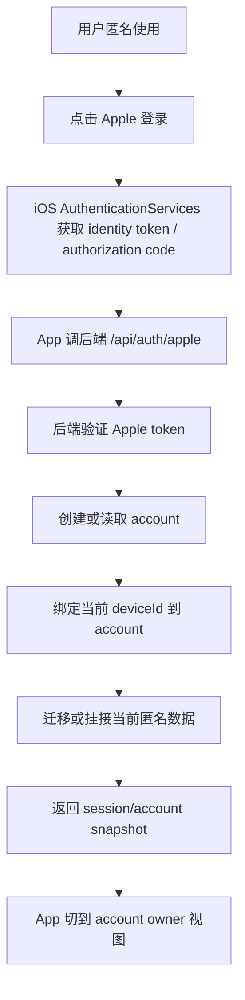

# Recallo 首版账号登录方案调研与执行清单

> 状态：草案，等待最终登录方式决策。  
> 目标：如果 App Store 首版从“匿名优先”改为“需要账号登录”，本文件作为账号部分的执行台账，避免把登录、数据迁移、删除账号、额度、隐私和审核材料拆成零散补丁。

## 1. 当前决策变化

用户已确认：

- 采用快速首版方案的大方向。
- 支持邮箱：`mingyuhan0814@gmail.com`。
- 每日真实 AI 生成额度：每天 5 篇，按 UTC day。
- 推荐好文不计入额度。
- 匿名用户可直接生成。
- 首版不启用 IAP/订阅。
- App Store 名称：Recallo。
- App Store Connect 仍提交到 `com.maxhan.shibei` 对应 App 下。

本次新增变化：

- 原方案是“首版暂不做账号，匿名优先，上架后 P1 做 Apple 登录”。
- 现在用户提出“首版需要做 Apple 登录，或者微信登录”。

这意味着首版范围从“匿名快速上架”变成“匿名 + 可选账号登录”的候选方案。它不是一个文案改动，而是会影响 App Review、隐私政策、数据模型、账号删除、额度绑定、推送 token 和真机验收。

## 2. 官方和服务调研结论

### 2.1 Apple 审核硬要求

来源：

- Apple App Review Guidelines: https://developer.apple.com/app-store/review/guidelines/
- Offering Account Deletion: https://developer.apple.com/support/offering-account-deletion-in-your-app/
- Sign in with Apple REST API token revocation: https://developer.apple.com/documentation/signinwithapplerestapi/revoke-tokens
- App Review preparation: https://developer.apple.com/distribute/app-review/

结论：

- 如果 App 支持账号创建，必须允许用户在 App 内发起账号删除。
- 删除账号不能只提供“发邮件申请”，必须在 App 内有清晰入口。
- 删除账号应删除开发者记录中不必保留的用户数据。
- 如果使用 Sign in with Apple，删除账号时还应处理 Apple 授权撤销/令牌撤销。
- 如果某些功能需要登录，App Review 需要可复现的登录路径；必要时要提供演示账号或说明。
- 如果使用微信、Google、Facebook 等第三方登录，通常不能只给第三方登录，必须同时提供等价的 Sign in with Apple 选项。

### 2.2 可选方案对比

| 方案 | 成熟度 | 首版复杂度 | App Review 风险 | 对 Recallo 的适配 | 结论 |
| --- | --- | --- | --- | --- | --- |
| 继续匿名优先，不做账号 | 高 | 低 | 低 | 最快上架，但数据恢复弱 | 原快速首版推荐 |
| 原生 Sign in with Apple + 自建账号绑定 | 高 | 中 | 中 | 最贴合 iOS 和现有后端；可保留匿名体验 | 如果首版必须账号，推荐 |
| Supabase Auth + Apple 登录 | 高 | 中高 | 中 | 提供 Auth 服务和用户表，但会引入外部 Auth 基础设施 | 可选，不建议首版迁移 |
| Firebase Auth + Apple 登录 | 高 | 中高 | 中 | iOS 成熟，但需要处理 Apple token 重新认证/撤销 | 可选，不建议首版迁移 |
| Clerk/Auth0 + Apple 登录 | 高 | 中高 | 中 | 账号管理成熟，但付费/外部依赖/SDK 集成成本更高 | 后续规模化可考虑 |
| 微信登录 | 中 | 高 | 高 | 对中国用户友好，但需微信开放平台、SDK、回调、隐私披露；且通常仍要同时提供 Apple 登录 | 不建议首版 |

### 2.3 推荐选择

如果目标仍是尽快 App Store 首版：

- 推荐保持“匿名可直接生成”。
- 如果必须加入账号，首版只做“可选 Sign in with Apple”，不做微信登录。
- 微信登录放到后续中国区增长版本，再和 Apple 登录、账号合并、隐私政策、SDK 合规一起做。

原因：

- Apple 登录是 iOS 原生审核路径，用户信任和审核可解释性最好。
- 微信登录会增加额外平台配置和审核变量，并可能触发必须同时提供 Sign in with Apple 的要求。
- 当前 Recallo 已经有匿名 deviceId、服务端用户数据、删除当前设备数据入口；最小增量是把 Apple subject 绑定到现有匿名 user，而不是替换整套 Auth 服务。

## 3. 首版账号能力边界

### 3.1 必须做

如果首版加入 Apple 登录，必须同时完成：

- 个人主页增加“登录/绑定 Apple 账号”入口。
- 登录必须是可选，不阻断首次体验。
- 匿名用户登录后，当前匿名设备下的数据必须绑定到 Apple account。
- 同一 Apple account 在多设备登录后，应能恢复章节、学习进度、收藏、通知和头像/昵称。
- 后端要有 account link 表，不能把 Apple identity 直接塞进 device 表。
- 每日额度要按 account 优先计数；未登录时按 anonymous device 计数。
- App 内必须提供“删除账号”入口。
- 删除账号必须删除 account link、profile、chapters、review progress、favorites、notifications、push tokens、quota records 中与该账号关联且无需保留的数据。
- 删除账号后本机回到新的匿名状态，不能继续拿旧账号数据。
- 隐私政策、App Privacy 标签、Review Notes、账号说明都要同步更新。

### 3.2 匿名使用的收口路线

“匿名可用”只作为首版过渡和低门槛体验，不作为长期正式身份。正式产品的长期个人资产应逐步归属到 Apple 账号。

| 阶段 | 策略 | 目标 | 工程要求 |
| --- | --- | --- | --- |
| v1.0 | 可选 Sign in with Apple + 匿名可用 | 降低首次体验门槛，同时提供数据绑定能力 | 登录时把当前 device 数据绑定到 account；文案明确匿名数据恢复边界 |
| v1.1 / v1.2 | 高价值动作前加强绑定提示 | 提升账号绑定率，减少长期匿名资产 | 在生成第二篇真实 AI 文章、收藏、跨设备恢复等动作前提示绑定；不要打断推荐好文体验 |
| v2.0 | 新用户默认 Apple 登录后使用完整功能 | 把正式身份收口到账号 | 老匿名用户首次打开先迁移；新用户登录后创建 account；后端仍兼容旧版本匿名请求 |
| 兼容期 | 匿名接口保留 1-2 个版本周期 | 避免旧版本和未迁移用户突然失效 | 后端区分 legacy anonymous 与 account 用户；监控匿名写入量后逐步收紧 |

关闭匿名主路径前必须完成：

- 登录迁移提示：说明当前设备上的章节、收藏、学习进度会绑定到 Apple 账号。
- 迁移接口和回归测试：同一 device 下章节、收藏、通知、生成任务、额度记录、push token 不丢失。
- 老版本兼容策略：旧版本 App 仍能完成基本读取/迁移，不因后端突然拒绝匿名请求而损坏。
- 隐私政策和账号说明更新：从“可匿名使用”调整为“Apple 登录用于保存和恢复学习资产”。
- App Store Connect 元数据和 Review Notes 更新：说明登录路径、删除账号路径和数据恢复逻辑。

### 3.3 首版不做

- 不做微信登录。
- 不做手机号登录。
- 不做邮箱密码登录。
- 不做 Google/Facebook 登录。
- 不做账号找回客服人工合并。
- 不做多账号切换。
- 不做跨账号迁移 UI。
- 不做付费订阅/IAP。

## 4. 推荐技术架构

### 4.1 数据模型

新增概念：

| 表/模型 | 作用 | 关键字段 |
| --- | --- | --- |
| `accounts` | 代表一个可恢复账号 | `id`, `provider`, `providerSubjectHash`, `emailHash`, `createdAt`, `deletedAt` |
| `account_device_links` | 绑定 Apple account 和匿名 device | `accountId`, `deviceId`, `linkedAt`, `lastSeenAt` |
| `user_profiles` 扩展 | profile 可属于 device 或 account | `ownerType`, `ownerId`, `displayName`, `avatarId` |
| 现有 chapter/progress/favorite/notification 表扩展 | 数据归属支持 account 优先 | `ownerType`, `ownerId`, `legacyDeviceId` |
| `account_deletion_jobs` | 删除账号审计和异步清理 | `accountId`, `status`, `requestedAt`, `completedAt`, `error` |

关键原则：

- 不把 Apple 原始 subject 明文散落到业务表。
- account 只是身份归属层；学习业务仍然按现有章节、进度、收藏模型工作。
- deviceId 继续保留，用于未登录体验和迁移锚点。
- 登录成功后优先用 account owner 查询；必要时把当前 device 的旧数据迁移/绑定到 account。

### 4.2 登录和迁移流程

迁移策略：

- 如果 account 是第一次出现，把当前 device 下的数据迁移到 account。
- 如果 account 已有数据，当前 device 也有匿名数据：
  - 首版不做复杂合并 UI。
  - 默认保留 account 数据为主。
  - 当前 device 的新匿名数据可作为“待合并”挂接到 account，避免静默丢失。
  - 如果冲突过复杂，首版先在登录前提示“登录后将以账号数据为准，本设备新内容会同步到账号”。

### 4.3 额度策略

| 用户状态 | 额度 owner | 规则 |
| --- | --- | --- |
| 未登录 | deviceId | 每天 5 篇，UTC day |
| 已登录 | accountId | 每天 5 篇，UTC day |
| 推荐好文导入 | 不计入 | 仍不消耗真实 AI 额度 |
| 登录当天 device 已用额度 | 迁移到 account 当日计数 | 防止换身份绕过额度 |

### 4.4 推送 token 策略

- APNs token 仍然来自设备。
- 未登录时 token 绑定 deviceId。
- 登录后 token 同时绑定 accountId + deviceId。
- 删除账号时删除 account 关联 token；如果用户继续匿名使用，重新注册新的 device token 绑定。

## 5. 是否使用第三方 Auth 服务

### 5.1 自建 Apple 登录绑定

适合当前 Recallo，因为：

- 已有后端、数据库和 deviceId。
- 当前只需要一个身份提供方：Apple。
- 不需要完整用户管理后台、组织、RBAC、企业 SSO。
- 可以最小增量实现账号恢复和删除。

代价：

- 要自己写 Apple token 验证、account 表、删除账号、session/token。
- 要自己维护安全测试和审计。

### 5.2 Supabase/Firebase/Clerk/Auth0

适合以后：

- 需要多登录方式。
- 需要邮件魔法链接、手机号、组织、后台管理、Web 同步。
- 需要托管用户管理和成熟 SDK。

不建议首版立刻切入：

- 当前会引入新平台、环境变量、回调 URL、SDK、用户迁移。
- 会把上架前风险从“一个 Apple 登录”扩大成“Auth 平台迁移”。

## 6. 执行 Checkpoints

### Checkpoint A：最终决策

- [x] 用户确认首版账号方案：加入可选 Apple 登录。
- [x] 首版只做 Apple 登录，不做微信。
- [ ] 用户在 Apple Developer 确认 `com.maxhan.shibei` App ID 是否启用 Sign in with Apple capability。
- [ ] 用户确认 App Store Connect 中 App 仍是 `com.maxhan.shibei` 对应 App。

### Checkpoint B：账号 PRD 和数据模型

- [x] 写 `docs/account-login-prd-zh.md`。
- [x] 明确登录入口文案、账号说明、删除账号文案。
- [x] 明确匿名数据绑定和冲突策略。
- [x] 明确删除账号范围。
- [x] 设计 DB migration。

### Checkpoint C：后端 Apple 登录

- [x] 新增 `accounts` 和 `account_device_links` migration。
- [x] 新增 Apple identity token 验证模块。
- [x] 新增 `/api/auth/apple`。
- [x] 新增 `/api/account` account snapshot 返回。
- [x] 新增 account owner 查询逻辑。
- [x] 新增 quota 按 account 优先计数。
- [ ] 新增后端测试：首次登录、重复登录、device 绑定、额度迁移。

### Checkpoint D：删除账号闭环

- [x] 新增 `DELETE /api/account`。
- [x] 删除或匿名化账号关联业务数据。
- [ ] 撤销 Apple token/authorization。
- [x] 删除 push token 绑定。
- [x] 写入删除完成审计。
- [ ] 新增后端测试：删除后不能恢复旧数据、匿名状态可继续使用。

Apple token revoke 需要补齐的生产配置：

- Apple Developer 的 Sign in with Apple private key、Team ID、Key ID。
- 服务端 client secret 生成。
- iOS 登录时已经把一次性 `authorizationCode` 发给后端。
- 后端用 authorization code exchange 换取 refresh token，并在删除账号时调用 Apple revoke tokens。

### Checkpoint E：iOS 前端登录

- [ ] 增加 Sign in with Apple capability。
- [x] 接入 `AuthenticationServices`。
- [x] 个人主页增加登录/已登录状态。
- [x] 登录成功后刷新全局 store。
- [x] 登录失败/取消有明确但轻量的提示。
- [x] 删除账号入口放入账号说明/账号设置。
- [x] 删除账号后清本地 session，回到匿名状态。

### Checkpoint F：隐私、审核、截图

- [ ] 更新隐私政策：Apple 登录、账号 ID、删除账号、数据恢复。
- [ ] 更新 App Privacy 标签：Identifiers/User ID/Contact Info 是否涉及。
- [ ] 更新 Review Notes：账号可选、删除账号路径、测试方法。
- [ ] 更新 App 内账号说明。
- [ ] 增加真机验收项：登录、重启恢复、换设备恢复、删除账号。

### Checkpoint G：发布门禁

- [ ] `npm run check` 通过。
- [ ] 后端部署健康检查通过。
- [ ] 真机验收无 P0 / 无未豁免 P1。
- [ ] App Store Connect 外部控制台确认 Sign in with Apple 与实际功能一致。
- [ ] Archive 截图和审核材料全部更新。

## 7. 用户需要亲自做的事

如果选择加入 Apple 登录，用户需要做：

1. Apple Developer > Certificates, Identifiers & Profiles > Identifiers > `com.maxhan.shibei`。
2. 确认或启用 `Sign in with Apple` capability。
3. Xcode Signing & Capabilities 中确认 `Sign in with Apple` capability 已加入 target。
4. App Store Connect 审核材料中确认账号说明和删除账号路径。
5. 如果审核需要，提供一个可复现的测试方式；Apple 登录通常审核员可自行登录，但需要 Review Notes 写清楚入口。

如果坚持微信登录，用户还需要额外做：

1. 申请微信开放平台移动应用。
2. 获得 AppID/AppSecret。
3. 配置 iOS Universal Link / URL Scheme。
4. 提供隐私政策中微信登录数据说明。
5. 同时保留 Sign in with Apple，避免第三方登录审核风险。

## 8. 当前建议

当前我建议：

1. 不在这一轮立即实现微信登录。
2. 如果用户坚持首版需要账号，就执行“可选 Sign in with Apple + 删除账号闭环”。
3. 如果目标是最快上 App Store，仍建议保持匿名优先，把 Apple 登录放到 1.1 或 1.2。
4. 无论哪种方案，Privacy Policy URL 和 Support URL 都必须先成为公开 HTTPS 页面；当前生产域名的 `/privacy/` 和 `/support/` 仍需要部署后验证。

## 9. 需要用户最终拍板

请只在下面三项中选一个作为最终方案：

| 选项 | 含义 | 上架速度 |
| --- | --- | --- |
| A | 首版保持匿名优先，不做账号 | 最快 |
| B | 首版加入可选 Sign in with Apple，不做微信 | 中等 |
| C | 首版加入 Apple + 微信 | 最慢，不推荐 |

推荐选择：B，如果你已经明确希望首版有账号；否则选择 A。
