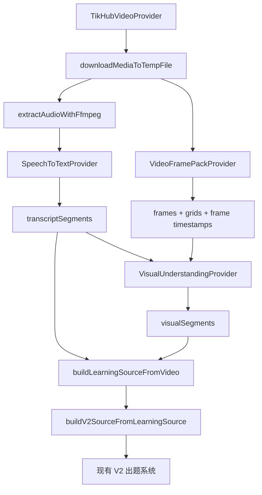

# 视频画面理解与 claude-real-video 适配方案

审查日期：2026-07-07

## 1. 结论

`claude-real-video` 不适合作为拾贝视频功能的整包黑盒依赖直接上线，但很适合作为第一版视频画面理解的技术参考。它的核心价值是把视频转成模型可读的关键帧、去重帧、九宫格 contact sheet、音频转写和 manifest。拾贝应复用这个方法，不复用它的取源、ASR 和最终数据合同。

可用度判断：

| 用法 | 判断 | 原因 |
| --- | --- | --- |
| 直接用 `crv <url>` 处理抖音/小红书链接 | 不推荐 | 它依赖 `yt-dlp` 和 cookies 路径；拾贝已经使用 TikHub，生产不应让后端持有平台登录态。 |
| 直接用它的 Whisper 转写 | 不推荐 | 拾贝已经有 `SpeechToTextProvider` 和本地 Faster-Whisper，避免维护两套 ASR。 |
| 直接把 `MANIFEST.txt` 喂给出题系统 | 不推荐 | 输出不是拾贝的 `LearningSource` 合同，且当前代码没有逐帧 timestamp。 |
| 借鉴或局部复用抽帧、去重、九宫格 | 推荐 | 这部分解决视频画面降采样和降噪问题，适合放到 `VisualUnderstandingProvider` 之前。 |
| 作为内部 QA viewer/report | 推荐 | `report.html` 和 `viewer.html` 适合评估抽帧阈值，不应暴露给用户。 |

上线可能性：

- 整包直接上线：约 40%。
- 参考其方法并改造成拾贝自己的视频视觉 adapter：约 80%-85%。

## 2. 外部项目信息

本次审查参考：

- GitHub：`https://github.com/HUANGCHIHHUNGLeo/claude-real-video`
- PyPI：`https://pypi.org/project/claude-real-video/`
- 本地审查快照：`/tmp/claude-real-video-review`
- 本地 wheel 审查：`claude_real_video-0.5.4-py3-none-any.whl`

公开 PyPI 页面在浏览器中显示 `0.4.0` 为最新，`pip index versions claude-real-video` 在本机显示 `0.5.4` 为最新。文档中的代码判断以本地下载的 `0.5.4` wheel 和 GitHub 当前源码为准；上线前需要重新 pin 版本并记录 hash。

项目能力概览：

- 输入：URL 或本地视频文件。
- URL 获取：`yt-dlp`，可选 cookies。
- 画面处理：`ffmpeg` scene detection + density floor 抽帧。
- 去重：Pillow 读取图片，按 downscaled RGB pixel diff 做 sliding-window 去重。
- 输出：`frames/*.jpg`、`grids/*.jpg`、`transcript.txt`、`MANIFEST.txt`、可选 `report.html` / `viewer.html`。
- 转写：优先字幕，fallback 到 `openai-whisper` CLI。
- 许可：MIT。

## 3. 对拾贝的适配原则

拾贝第一版视频链路已经确定为 source-first：

```text
用户粘贴抖音/小红书链接
-> TikHub 获取元数据和可处理播放地址
-> 后端短期下载视频
-> ffmpeg 抽音频
-> Faster-Whisper ASR
-> 视频画面包生成
-> 多模态模型或 OCR 输出 visualSegments
-> LearningSource
-> V2 出题系统
```

`claude-real-video` 应只影响中间的“视频画面包生成”：

```text
mediaFile.path
-> keyframe extractor
-> deduper
-> contact sheet builder
-> VideoFramePack
-> VisualUnderstandingProvider
-> LearningSource.visualSegments
```

关键原则：

- 不替换 TikHub。
- 不替换 `SpeechToTextProvider`。
- 不让 V2 出题系统感知具体视觉模型。
- 不把原始视频或帧图长期保存为默认行为。
- 不把 `MANIFEST.txt` 当作产品合同。
- 视觉理解失败时，ASR 文本链路仍可继续，除非视频内容本身低于最小可学习文本阈值。

## 4. 需要从 claude-real-video 借鉴的模块

### 4.1 Scene-aware 抽帧

它使用 `ffmpeg select` 同时满足两个目标：

- 画面变化明显时抽取关键帧。
- 即使画面变化不明显，也按 `fps_floor` 保底抽帧。

这比固定每秒一帧更适合短视频：

- 静态教程页不会重复产生大量近似截图。
- 快速切换的操作视频不会漏掉关键 UI 状态。
- 口播视频可以较低帧率处理，降低视觉模型成本。

拾贝改造点：

- 抽帧时必须保留 timestamp。
- 文件名建议使用 `frame_0001_12.340s.jpg` 或额外写 `frames.json`。
- 限制总帧数，第一版建议默认 `VIDEO_FRAME_MAX_FRAMES=30`。

### 4.2 Sliding-window 去重

它用 16x16 RGB 签名和像素差异判断近似重复帧，且不是只和前一帧比较，而是和最近 N 个保留帧比较。这对 A-B-A 镜头切回很有用。

拾贝改造点：

- 去重记录要保留到 `VideoFramePack.debug.records`，便于 QA。
- 生产默认不保留 dropped frames。
- 内部 benchmark 可以启用 report，帮助调参。

### 4.3 Contact sheet

它把 9 张连续关键帧拼成一张图。对视觉模型来说，contact sheet 通常比逐张图更省调用次数，也更容易看出视频进展。

拾贝改造点：

- contact sheet 每格需要显示短 label，例如 `12.3s`。
- `VideoFramePack` 同时保留单帧和九宫格引用。
- 视觉模型 provider 可以优先读 grid，必要时再读单帧。

## 5. 不应直接复用的模块

### 5.1 URL 获取

`claude-real-video` 用 `yt-dlp` 和 cookies 处理 URL。这不适合拾贝生产：

- 抖音/小红书公开视频第一版已经用 TikHub。
- cookies 会引入账号安全和合规风险。
- `yt-dlp` 对国内平台和短链解析稳定性不可控。

结论：只允许 local file 输入，不走它的 URL fetch。

### 5.2 ASR

`claude-real-video` 的 Whisper CLI 不是拾贝主链路：

- 拾贝已经有 `VIDEO_ASR_PROVIDER=local_whisper`。
- 后端的 ASR 成本、错误、耗时已经通过 `mediaUsage` 记录。
- 重复引入 Whisper CLI 会增加部署镜像和故障面。

结论：视频画面 adapter 接收 `transcriptSegments` 作为上下文，不自行转写。

### 5.3 Manifest

当前源码生成的 `MANIFEST.txt` 不包含逐帧时间戳，只包含 duration、frames dir、transcript note 和 transcript。它适合人工给 LLM 看，不适合作为拾贝内部数据合同。

结论：新增 `VideoFramePack` JSON 合同，不依赖 manifest。

## 6. 拾贝新增合同

建议新增内部结构：

```ts
type VideoFramePack = {
  provider: "crv_style_ffmpeg"
  video: {
    durationSeconds: number | null
    width?: number
    height?: number
    fps?: number
  }
  frames: Array<{
    id: string
    path: string
    startSeconds: number
    endSeconds: number
    order: number
    width?: number
    height?: number
    kept: boolean
    diffPercent?: number | null
  }>
  grids: Array<{
    id: string
    path: string
    frameIds: string[]
    startSeconds: number
    endSeconds: number
    rows: number
    cols: number
  }>
  debug: {
    extractedFrameCount: number
    keptFrameCount: number
    cappedFrameCount: number
    sceneThreshold: number
    fpsFloorSeconds: number
    dedupThresholdPercent: number
    dedupWindow: number
  }
}
```

`VisualUnderstandingProvider` 输出继续使用现有 `visualSegments` 形态：

```ts
{
  id: "visual-001",
  sourceRole: "visual_summary",
  startSeconds: 12.3,
  endSeconds: 18.8,
  text: "画面展示 Figma Motion 的 shader 面板，强调路径动画和流体效果。"
}
```

## 7. 推荐架构



模块边界：

- `VideoFramePackProvider` 负责抽帧、去重、拼 grid、记录时间戳。
- `VisualUnderstandingProvider` 负责调用 Qwen-VL、Gemini、OpenAI Vision 或本地 VLM，并输出文本化视觉片段。
- `LearningSource` 只关心 `transcriptSegments` 和 `visualSegments`，不关心图片文件细节。
- 出题系统只关心 `normalizedText` 和 source blocks。

## 8. 部署和资源控制

建议环境变量：

```bash
VIDEO_FRAME_PROVIDER=crv_style_ffmpeg
VIDEO_FRAME_MAX_FRAMES=30
VIDEO_FRAME_FPS_FLOOR_SECONDS=1.0
VIDEO_FRAME_SCENE_THRESHOLD=0.30
VIDEO_FRAME_DEDUP_THRESHOLD_PERCENT=8
VIDEO_FRAME_DEDUP_WINDOW=4
VIDEO_FRAME_GRID_ROWS=3
VIDEO_FRAME_GRID_COLS=3
VIDEO_FRAME_TIMEOUT_MS=90000
VIDEO_VISUAL_PROVIDER=qwen-vl
VIDEO_VISUAL_MODEL=qwen3-vl-flash
QWEN_API_KEY=<set-in-backend-env>
QWEN_API_BASE_URL=https://dashscope.aliyuncs.com/compatible-mode/v1
VIDEO_VISUAL_MAX_GRIDS=4
```

第一版推荐视觉模型为 `qwen3-vl-flash`。它只负责把关键帧/九宫格解释成 `visualSegments`，不参与 V2 出题；如真实样本显示画面 OCR 或 UI 识别不足，再把 `VIDEO_VISUAL_MODEL` 升级为 `qwen3-vl-plus` 做兜底。为了避免成本和复杂度过早上升，第一版不默认使用 `qwen-vl-max` 或 `glm-5v-turbo`。

生产要求：

- 所有 ffmpeg 子进程必须有 timeout。
- 所有临时目录必须在 `finally` 中清理。
- 单个视频必须限制最大下载字节、最大时长、最大帧数。
- 视觉模型调用必须记录 provider、model、耗时、成本和 segment 数。
- 原始视频和帧图默认不持久化；只持久化 `LearningSource` 和必要引用。
- 内部 QA report 可以保存到 `docs/quality-runs`，不能作为用户侧内容。

## 9. 自查后的风险清单

| 风险 | 严重度 | 处理方式 |
| --- | --- | --- |
| `claude-real-video` manifest 没有逐帧 timestamp | 高 | 不依赖 manifest；自建 `VideoFramePack` 并从 ffmpeg 输出 timestamp。 |
| 视觉模型未选型 | 中 | 先实现 provider 边界和 no-op fallback；接入时优先做 Qwen-VL/Gemini spike。 |
| 只用 DeepSeek 无法看图 | 高 | DeepSeek 继续负责出题；视觉摘要由独立多模态 provider 生成文本。 |
| ffmpeg 抽帧 CPU/磁盘占用 | 中 | 队列化、timeout、max frames、max bytes、worker 隔离。 |
| 抽帧阈值不适合所有短视频 | 中 | benchmark 至少覆盖教程、口播、快速剪辑、屏幕录制。 |
| 视频画面摘要可能 hallucinate | 中 | visual prompt 要要求只描述可见内容；source blocks 标记为 `visual_summary`，后续评测单独看。 |
| 用户隐私和版权 | 高 | 只处理用户提交的公开链接；不绕过私密内容；删除章节时清理提取内容。 |
| 第三方项目更新快 | 中 | 不把它作为运行时强依赖；如引用代码，pin commit/hash 并保留 MIT license。 |

## 10. 建议下一步

按开发计划先做一个 `VideoFramePackProvider`，不急着接真实视觉模型。第一阶段目标是把同一个抖音样本处理成可审查的 frames/grids/timestamped JSON，并通过单测和 benchmark 验证它能稳定接到现有 `extractVideoLearningSource`。

完成这个阶段后，再决定第二阶段接哪个视觉模型。出题系统不需要为这次改动做 prompt 分支。
